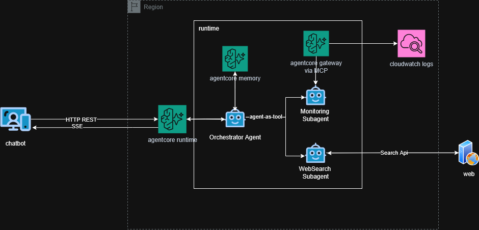
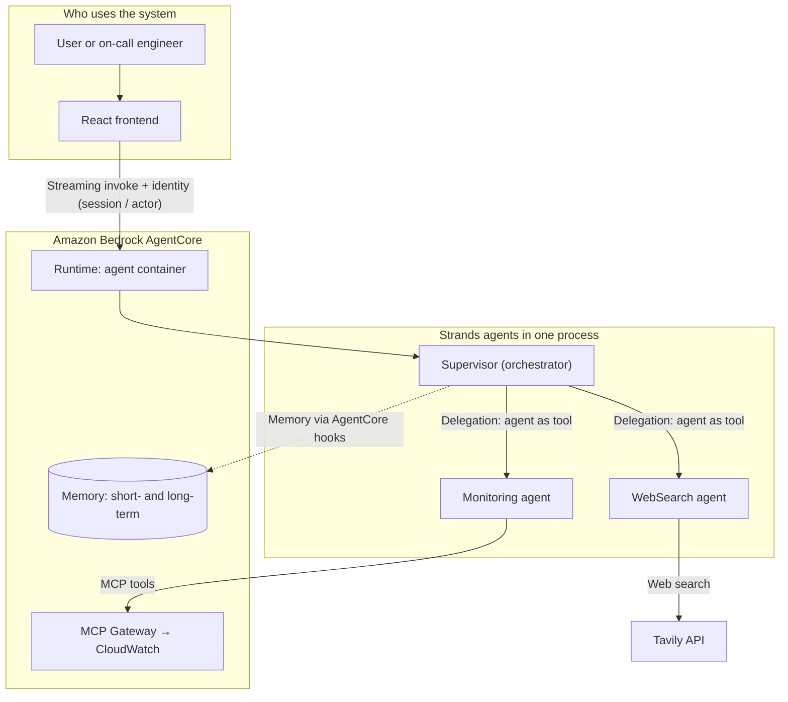

# incident-multiagent

An **AWS incident-response** assistant: an operations-oriented chat that combines natural-language reasoning with **CloudWatch** access (via MCP tools) and web search (documentation and best practices).

This repository demonstrates a clear **multi-agent** pattern: an orchestrator delegates to specialists, deployed on **Amazon Bedrock AgentCore** and implemented with the **Strands Agents SDK** in Python.

---

## Core concepts (plain language)

| Piece | Role |
|--------|------|
| **AgentCore** | Managed service that runs the agent container, exposes the invocation endpoint, integrates **memory**, and can attach an **MCP Gateway** for external tools. |
| **Strands** | Python framework for agents (Bedrock models, tools, streaming). Every agent in this project is a Strands agent. |
| **Orchestrator (supervisor)** | The primary Strands agent: it does not do everything itself—it decides when to call the other agents **as tools** (*agent-as-tool*). That avoids a separate A2A protocol inside the same process. |
| **Frontend** | A React app that talks to the AgentCore runtime (streaming) and uses Cognito-aligned authentication from the deployment. |

In practice: the user types in the chat → the **AgentCore runtime** runs `main.py` → the **Strands supervisor** interprets the request and, when needed, invokes the **monitoring** agent (MCP tools to CloudWatch) or the **web search** agent (Tavily).

---

## Multi-agent architecture

**How to read the diagram:** everything inside the *Strands* block runs in **a single container** on **one AgentCore runtime**. The supervisor is the logical entry point for the user message; the other agents are specialists invoked by it.

---

## Monorepo layout

| Directory | Contents |
|-----------|----------|
| `backend/` | **AWS CDK** (TypeScript), Docker image for the agent, Python Strands code and `BedrockAgentCoreApp`. |
| `frontend/` | Chat UI against the AgentCore endpoint. |

---

## Request lifecycle

1. The frontend sends the prompt to the AgentCore **runtime ARN**.
2. **AgentCore** starts or reuses the container and calls the entrypoint (`@app.entrypoint`).
3. The **supervisor** (Strands) reasons and, when appropriate, runs the tool that wraps the monitoring or web-search agent.
4. Events (text, tool use, errors) are **streamed** back to the client for the conversation and delegation UI.

---

## Main technologies

- **Amazon Bedrock** (Claude models via Strands).
- **Bedrock AgentCore** (runtime, memory, MCP gateway as defined in the stack).
- **Strands Agents SDK** (agents, tools, streaming).
- **AWS CDK v2** (`aws-cdk-lib`) for cloud resources.

